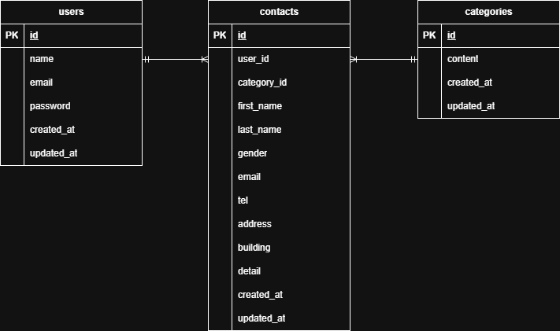

# test_contact-form

## 環境構築

### Docker ビルド

```bash
docker-compose up -d --build
```

### Laravel 環境構築

1. PHP コンテナに入る。

```bash
docker-compose exec php bash
```

2. Laravel に必要なパッケージをインストールする。

```bash
composer install
```

3. 環境変数ファイルを作成する。

```bash
cp .env.example .env
```

※ `.env`ファイル内の環境変数（DB 接続情報など）は、環境に合わせて適宜変更してください。

4. データベースのマイグレーション・シーディングを実行する。

```bash
php artisan migrate --seed
```

※ テーブル作成（migration）とダミーデータ作成（seeding）を同時に実行します。

## 使用技術(実行環境)

- PHP 8.1.33
- Laravel 8.83.29
- MySQL 8.0.26
- nginx 1.21.1

## ER 図



## URL

※ ローカル環境で実行予定
